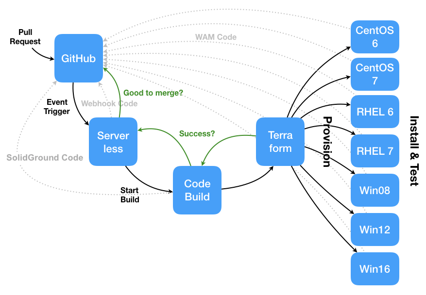

# solidground
SolidGround launches Windows and Linux instances and installs [Watchmaker](https://github.com/plus3it/watchmaker) to test that it installs and runs.

SolidGround can be run locally or with [AWS CodeBuild](https://aws.amazon.com/codebuild/). In order to use it, you will need AWS credentials and to provide environment variables.

## ENVIRONMENT VARIABLES EXPECTED BY SOLIDGROUND

Variable | Default | Req/Opt (in CodeBuild) | Description
--- | --- | --- | ---
`TF_VAR_tfi_subnet_id` | [empty] | optional | Whether or not to use a subnet. CodeBuild instance must be able to access.
`TF_VAR_tfi_win_instances` | [empty] | optional | Acceptable values are "win12src", "win16src", "win19src", "win12sa", "win16sa", and/or "win19sa" (comma separated list). If none are wanted, remove variable from CodeBuild.
`TF_VAR_tfi_lx_instances` | [empty] | optional | Acceptable values are "centos6src", "centos7src", "rhel6src", "rhel7src", "centos6sa", "centos7sa", "rhel6sa" and/or "rhel7sa" (comma separated list). If none are wanted, remove variable from CodeBuild.
`TF_VAR_tfi_rm_user` | Administrator | optional | username to use when connecting via WinRM to Windows instances
`TF_VAR_tfi_ssh_user` | root | optional | Which username to use when connecting via SSH to Linux instances.
`TF_VAR_tfi_instance_profile` | [empty] | optional | Instance profile to be used in provisioning resources. This is generally the same as the role if the role is an EC2 role.
`TF_VAR_tfi_assign_public_ip` | false | optional | Whether or not to assign a public IP to the instances built by Terraform.
`TF_VAR_tfi_win_instance_type` | t2.large | optional | AWS instance type for Windows instances.
`TF_VAR_tfi_lx_instance_type` | t2.medium | optional | AWS instance type for Linux instances.
`TF_VAR_tfi_git_repo` | https://github.com/plus3it/watchmaker.git | optional | Which git repository to use in getting watchmaker code.
`TF_VAR_tfi_git_ref` | master | optional | Which branch or pull request number of the repository to use in getting watchmaker code.
`TF_VAR_tfi_common_args` | -n --log-level debug | optional | Command line arguments used when installing Watchmaker (Windows/Linux).
`TF_VAR_tfi_win_args` | --log-dir=C:\\Watchmaker\\Logs | optional | Command line arguments used when installing Watchmaker (Windows).
`TF_VAR_tfi_lx_args` | --log-dir=/var/log/watchmaker | optional | Command line arguments used when installing Watchmaker (Linux).
`TF_VAR_tfi_s3_bucket` | mybucket | optional | Which S3 bucket to place logs from installs and output from Terraform.
`TF_VAR_tfi_docker_slug` | none | optional | Which Docker container to use in building standalones.
`TF_VAR_tfi_instance_multiplier` | none | optional | How many of each instance type to create (Default: 1)
`TF_DESTROY_AFTER_TEST` | true | optional | Whether or not to destroy all resources created after the test. (WARNING: Depending on failure, Terraform may not always be able to destroy provisioned resources.)
`TF_LOG` | DEBUG | optional | Log level of Terraform.
`TF_LOG_PATH` | terraform.log | optional | File where Terraform log is stored.

## Development Paths

SolidGround performs integration tests of Watchmaker. Development of SolidGround also involves testing: _SolidGround_ testing. Keep these development paths separate to avoid confusion.

### SolidGround development, _SolidGround_ testing

Local testing of a SolidGround branch involves checking out the development branch on the local system. Environment variables do not indicate the correct SolidGround reference to test because you have used Git to put the correct SolidGround code in play on your local development system.

CodeBuild testing of a remote SolidGround branch involves commenting `go codebuild go` on a _SolidGround_ repository pull request. Through the SolidGround webhook, the correct Git reference to SolidGround is passed to CodeBuild and CodeBuild fetches that SolidGround reference. You can verify which SolidGround reference was used by checking the `Build details` of an individual build in Codebuild. This will list, for example, `Source provider: GitHub, Repository: plus3it/solidground, Source version: pr/55`.

Additionally, remember that the SolidGround reference (e.g., pull request) to test is used either on your local system or the CodeBuild test instance but not on each EC2 instance built though Terraform.

### Watchmaker development, _Watchmaker_ testing

On the other hand, integration testing of Watchmaker begins by commenting `go codebuild go` on a _Watchmaker_ repository pull request. The Watchmaker-SolidGround webhook will set an environment variable to pass the correct Watchmaker reference (e.g., pull request #330) to SolidGround. On each server that SolidGround builds, the Watchmaker reference will be used when retrieving Watchmaker with Git.

In contrast to SolidGround development, the Watchmaker reference (e.g., pull request) to test is used on each EC2 instance built through Terraform but is not used either on your local system or the CodeBuild test instance.
